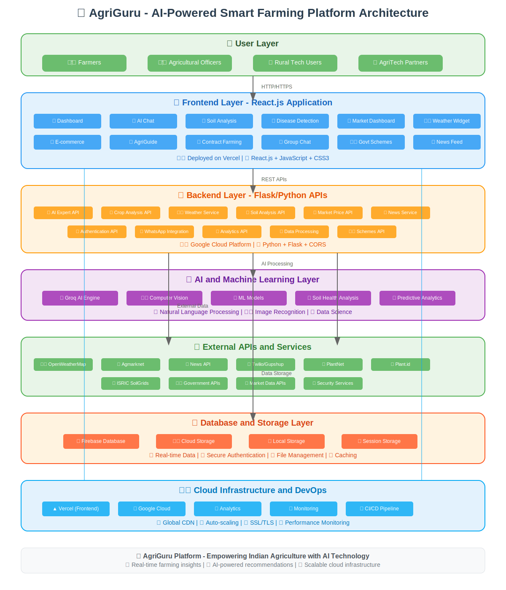

# 🏗️ AgriGuru System Architecture Documentation

## 📋 Table of Contents
- [Architecture Overview](#architecture-overview)
- [System Components](#system-components)
- [Data Flow](#data-flow)
- [Technology Stack](#technology-stack)
- [Deployment Architecture](#deployment-architecture)
- [Security Architecture](#security-architecture)
- [Performance Considerations](#performance-considerations)
- [Future Enhancements](#future-enhancements)

## 📊 Architecture Overview

AgriGuru is built on a modern, cloud-native architecture that ensures scalability, reliability, and optimal performance for agricultural users across India. The platform follows a layered architecture pattern with clear separation of concerns.



### 🎯 Design Principles

1. **Microservices Architecture**: Modular services for better maintainability
2. **API-First Design**: RESTful APIs enabling third-party integrations
3. **Cloud-Native**: Leveraging cloud services for scalability and reliability
4. **Mobile-First**: Responsive design optimized for mobile users
5. **Multilingual Support**: Supporting multiple Indian languages
6. **Real-time Data**: Live updates for weather, prices, and alerts

## 🔧 System Components

### 👥 User Layer
The user layer represents different types of users who interact with the AgriGuru platform:

- **🧑‍🌾 Farmers**: Primary end-users seeking agricultural guidance
- **👨‍💼 Agricultural Officers**: Government officials monitoring farming activities
- **📱 Rural Tech Users**: Technology-adopting farmers
- **🏢 AgriTech Partners**: Organizations integrating with our services

### 💻 Frontend Layer

**Technology**: React.js with modern JavaScript (ES6+)
**Deployment**: Vercel with global CDN

#### Core Components:
- **Dashboard**: Central hub displaying farm analytics, weather, and recommendations
- **AI Chat**: Conversational interface powered by Groq AI
- **Soil Analysis**: Interactive soil health monitoring dashboard
- **Disease Detection**: Image upload and analysis interface
- **Market Dashboard**: Real-time price tracking and market analytics
- **Weather Widget**: Location-based weather forecasts and alerts
- **E-commerce**: Agricultural marketplace for buying/selling
- **AgriGuide**: Comprehensive farming knowledge repository
- **Contract Farming**: Digital contract management system
- **Group Chat**: Community communication platform

#### Frontend Architecture:
```
src/
├── components/          # Reusable UI components
│   ├── AIChat/         # AI conversation interface
│   ├── WeatherWidget/  # Weather display component
│   ├── SoilWidget/     # Soil analysis component
│   └── CropStatusWidget/ # Crop health monitoring
├── pages/              # Route-based page components
│   ├── Dashboard/      # Main dashboard
│   ├── Market/         # Market analysis page
│   ├── Shopping/       # E-commerce interface
│   └── Contacts/       # Support and contact
├── services/           # API integration services
│   ├── aiService.js    # AI chat integration
│   ├── weatherService.js # Weather data fetching
│   └── soilService.js  # Soil analysis APIs
├── contexts/           # React context providers
└── i18n/              # Internationalization
```

### 🔧 Backend Layer

**Technology**: Python Flask with Gunicorn
**Deployment**: Google Cloud Platform

#### Core APIs:
- **AI Expert API** (`/api/expert-advice`): Groq-powered agricultural consultation
- **Crop Analysis API** (`/api/analyze-crop`): Computer vision crop disease detection
- **Weather Service** (`/api/weather-advice`): Weather data aggregation
- **Soil Analysis API** (`/api/soil-analysis`): Soil health assessment
- **Market Price API** (`/api/market-insights`): Commodity price tracking
- **News Service** (`/api/news`): Agricultural news aggregation
- **Authentication API** (`/api/auth`): User management and security
- **WhatsApp Integration** (`/api/whatsapp`): Notification services

#### Backend Architecture:
```python
backend/
├── farming_expert_app_ai.py    # Main Flask application
├── services/
│   ├── groq_service.py         # Groq AI integration
│   ├── weather_service.py      # Weather data processing
│   ├── market_service.py       # Market data aggregation
│   └── soil_service.py         # Soil analysis logic
├── models/
│   ├── crop_models.py          # ML models for crop analysis
│   └── soil_models.py          # Soil analysis models
├── utils/
│   ├── image_processing.py     # Computer vision utilities
│   └── data_validation.py      # Input validation
└── config/
    └── settings.py             # Application configuration
```

### 🧠 AI & Machine Learning Layer

#### Groq AI Integration:
- **Natural Language Processing**: Understanding farmer queries in multiple languages
- **Context Awareness**: Maintaining conversation context for better recommendations
- **Agricultural Expertise**: Domain-specific knowledge for farming advice

#### Computer Vision:
- **Crop Disease Detection**: Image analysis using Plant.id and PlantNet APIs
- **Soil Analysis**: Visual soil assessment and composition analysis
- **Plant Identification**: Species recognition and classification

#### Machine Learning Models:
- **Predictive Analytics**: Crop yield prediction and market trend analysis
- **Recommendation Engine**: Personalized farming recommendations
- **Risk Assessment**: Disease outbreak and weather risk predictions

### 🔗 External APIs Integration

#### Weather Services:
- **OpenWeatherMap API**: Current weather and 7-day forecasts
- **Regional Weather APIs**: Local meteorological data

#### Market Data:
- **Agmarknet API**: Government commodity price data
- **Private Market APIs**: Additional price sources for accuracy

#### Plant & Soil Services:
- **Plant.id API**: Advanced plant disease identification
- **PlantNet API**: Plant species identification
- **ISRIC SoilGrids**: Global soil property data

#### Communication Services:
- **Twilio API**: SMS notifications
- **Gupshup API**: WhatsApp Business integration
- **Firebase Cloud Messaging**: Push notifications

### 💾 Database & Storage Architecture

#### Primary Database: Firebase Firestore
```javascript
// Database Structure
users: {
  userId: {
    profile: {...},
    farmData: {...},
    preferences: {...}
  }
}

crops: {
  cropId: {
    analysis: {...},
    history: [...],
    recommendations: [...]
  }
}

weather: {
  location: {
    current: {...},
    forecast: [...],
    alerts: [...]
  }
}
```

#### Storage Solutions:
- **Firebase Storage**: User uploads, crop images, documents
- **Cloud Storage**: Large datasets, ML models, backups
- **Local Storage**: Client-side caching, offline data
- **Session Storage**: Temporary user session data

### ☁️ Cloud Infrastructure

#### Frontend Deployment (Vercel):
- **Global CDN**: Edge locations for fast content delivery
- **Automatic Scaling**: Traffic-based scaling
- **SSL/TLS**: End-to-end encryption
- **Performance Monitoring**: Real-time metrics

#### Backend Deployment (Google Cloud):
- **Compute Engine**: Scalable virtual machines
- **Load Balancing**: Traffic distribution
- **Auto Scaling**: Resource optimization
- **Monitoring**: Application performance tracking

## 🔄 Data Flow Architecture

### 1. User Request Flow
```
User Interface → Frontend (React) → Backend APIs (Flask) → External APIs/AI → Database → Response
```

### 2. AI Chat Flow
```
User Query → Frontend → AI Expert API → Groq AI Processing → Contextual Response → Frontend → User
```

### 3. Crop Analysis Flow
```
Image Upload → Frontend → Crop Analysis API → Computer Vision → Disease Detection → Recommendations → Frontend
```

### 4. Weather Data Flow
```
Location → Backend → OpenWeatherMap API → Data Processing → Weather Advice → Frontend → User
```

## 🛠️ Technology Stack

### Frontend Technologies:
- **React.js 18**: Component-based UI framework
- **JavaScript ES6+**: Modern JavaScript features
- **CSS3**: Responsive styling with Flexbox/Grid
- **HTML5**: Semantic markup
- **PWA**: Progressive Web App capabilities

### Backend Technologies:
- **Python 3.9+**: Core programming language
- **Flask**: Lightweight web framework
- **Gunicorn**: WSGI HTTP Server
- **Flask-CORS**: Cross-origin resource sharing
- **Requests**: HTTP library for API calls

### AI/ML Technologies:
- **Groq API**: Large language model integration
- **OpenCV**: Computer vision processing
- **NumPy**: Numerical computing
- **Pandas**: Data manipulation and analysis
- **Scikit-learn**: Machine learning algorithms

### Database Technologies:
- **Firebase Firestore**: NoSQL document database
- **Firebase Storage**: File storage service
- **Firebase Auth**: Authentication service

### DevOps & Deployment:
- **Vercel**: Frontend deployment platform
- **Google Cloud Platform**: Backend infrastructure
- **GitHub**: Version control and CI/CD
- **Docker**: Containerization (optional)

## 🔒 Security Architecture

### Authentication & Authorization:
- **Firebase Authentication**: Multi-factor authentication
- **JWT Tokens**: Secure session management
- **Role-based Access**: User permission levels

### API Security:
- **Rate Limiting**: Prevent API abuse
- **Input Validation**: Sanitize user inputs
- **CORS Policy**: Controlled cross-origin requests
- **HTTPS Encryption**: Secure data transmission

### Data Protection:
- **Encryption at Rest**: Database encryption
- **Encryption in Transit**: SSL/TLS protocols
- **Privacy Compliance**: Data handling policies
- **Secure File Upload**: Image validation and scanning

## ⚡ Performance Considerations

### Frontend Optimization:
- **Code Splitting**: Lazy loading of components
- **Image Optimization**: WebP format and compression
- **Caching Strategy**: Browser and CDN caching
- **Bundle Optimization**: Webpack optimizations

### Backend Optimization:
- **Database Indexing**: Query optimization
- **Connection Pooling**: Efficient database connections
- **Caching Layer**: Redis for frequently accessed data
- **Async Processing**: Non-blocking operations

### Infrastructure Optimization:
- **Auto Scaling**: Dynamic resource allocation
- **Load Balancing**: Traffic distribution
- **CDN Integration**: Global content delivery
- **Monitoring**: Performance tracking and alerts

## 🚀 Future Enhancements

### Planned Features:
- **Mobile Application**: Native iOS and Android apps
- **IoT Integration**: Sensor data collection and analysis
- **Blockchain**: Supply chain tracking and verification
- **Advanced Analytics**: Machine learning insights

### Scalability Improvements:
- **Microservices Migration**: Service decomposition
- **Kubernetes Deployment**: Container orchestration
- **Event-Driven Architecture**: Asynchronous communication
- **Multi-Region Deployment**: Global availability

### AI Enhancements:
- **Custom ML Models**: Domain-specific models
- **Real-time Processing**: Stream processing capabilities
- **Voice Interface**: Speech recognition and synthesis
- **Augmented Reality**: AR-based crop analysis

---

## 📞 Architecture Support

For questions about the system architecture, please contact:
- **Email**: architecture@agriguru.com
- **GitHub Issues**: [Technical Questions](https://github.com/shriom17/AgriGuru/issues)
- **Documentation**: [Developer Docs](https://docs.agriguru.com)

---

**© 2025 AgriGuru - Built with ❤️ for Indian Agriculture**